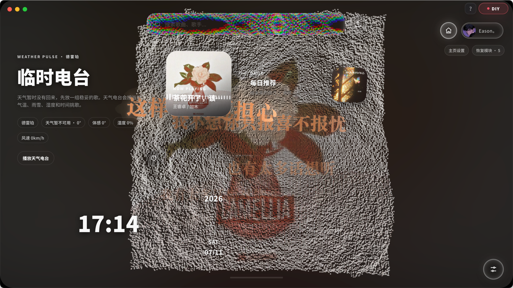
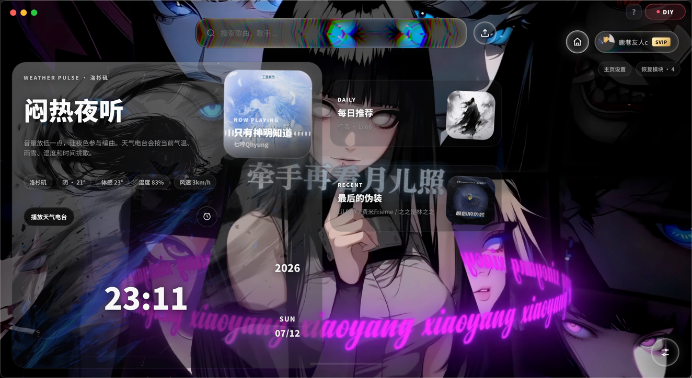
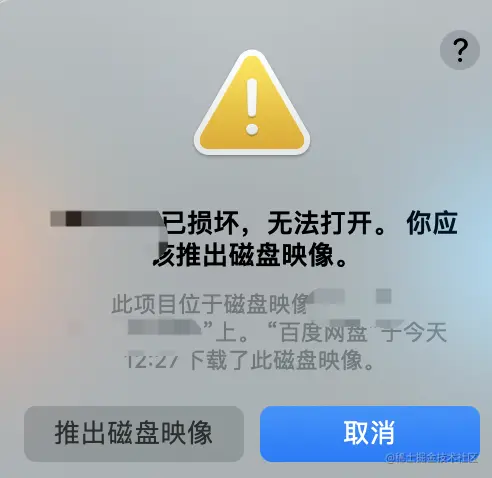
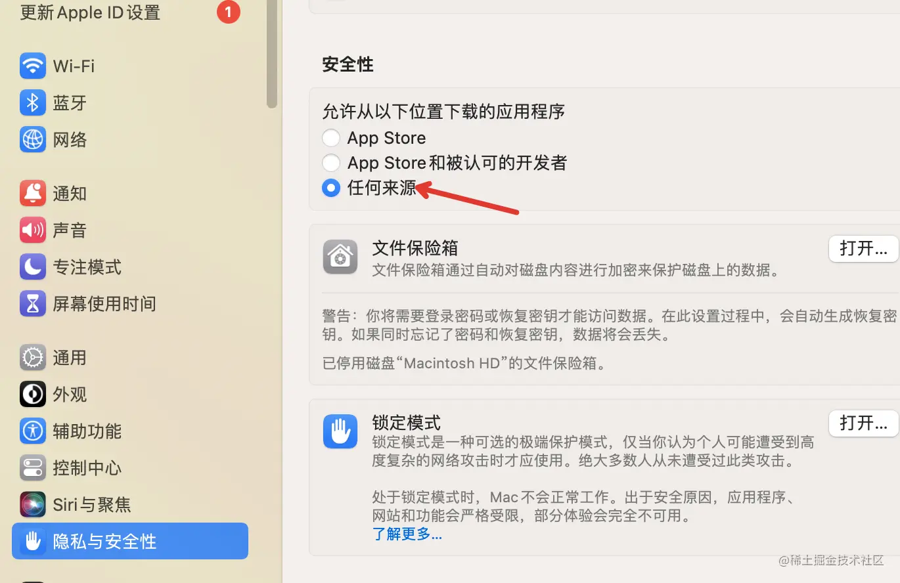
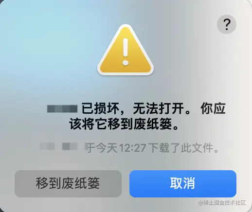
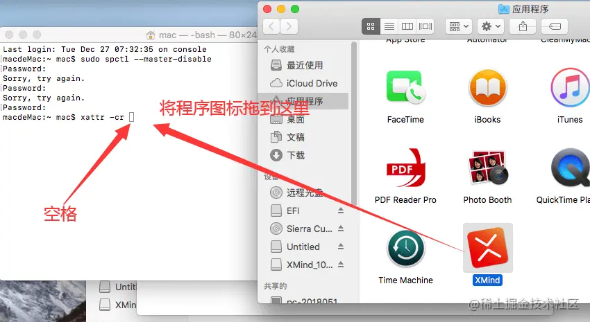

# 说明
当前项目由于是属于视觉特效优先，采用three.js做视觉效果以及electron编译打包，所以安装包体积稍微会大一些且比较吃CPU、GPU资源，本人的配置是2019pro，16英寸 i7-32g 目前来说属于能用但不算卡顿，请判断电脑配置是否可用后再进行下载。
## 基于Mineradio 针对Mac 进行优化 
* 当前 Mac 仓库及更新发布页：https://github.com/prometheus-lumen/Mineradio-Mac
* 如需官方源代码以及windows版本，请移步至原创作者：https://github.com/XxHuberrr/Mineradio

## 关于在mac上安装一些软件时，会提示如下弹框，导致无法安装。


---
解决办法↓↓↓
1. 在终端或控制台输入如下命令，然后回车，就会弹出提示输入密码，输入开机密码回车。
```shell
sudo spctl --master-disable
```
以上操作是为了打开：系统偏好设置 – 安全性与隐私 – 通用 ，中的“任何来源”选项。



2. 将应用移入应用程序中后，打开提示已损坏，无法打开。你应该将它移到废纸篓。或你应该推出磁盘映像。


在终端中输入
xattr -cr (这里要注意后面有个空格)。
将提示已损坏，无法打开的程序图标拖到命令栏中。

拖入命令行后， 拖入程序图标后类似显示
```shell
xattr -cr /Applications/XXX.app
```
然后回车，再去打开程序即可正常运行。
提示：在macOS Ventura 13系统上操作之后如果还是提示损坏，就右键软件，选择打开，再点击打开。
